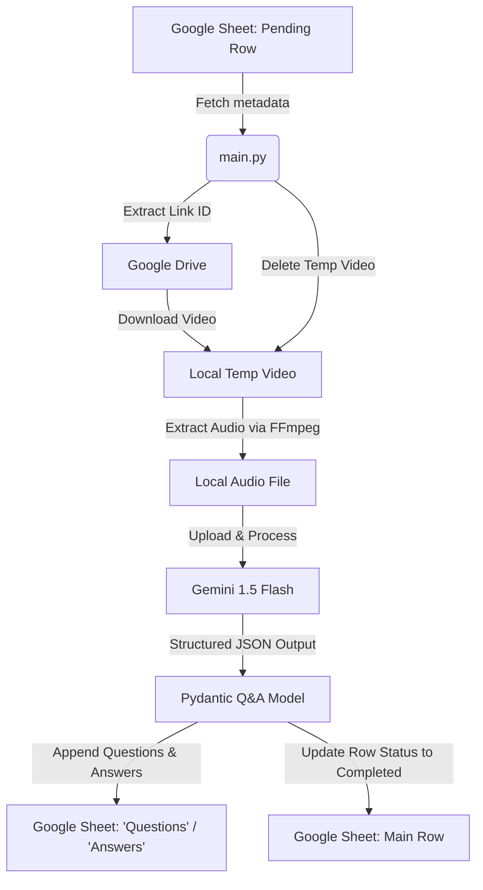

# interview-QA-extractor

A Python-based workflow integrating Google Drive, Sheets, and the Gemini API to download interview recordings, extract audio, and automatically generate and catalog structured Question & Answer pairs.

---

## 🚀 Features

- **Metadata Sync:** Reads pending interviews and Google Drive video links directly from a Google Sheet.
- **Automated Downloads:** Uses a Google Service Account to download large video files securely from Google Drive.
- **Audio Extraction:** Extracts high-quality audio tracks using FFmpeg (`imageio-ffmpeg`) programmatically.
- **AI Analysis:** Leverages Gemini (`gemini-1.5-flash`) with structured JSON schema outputs via Pydantic to extract interviewer questions and matching interviewee answers.
- **Result Export:** Automatically creates and appends questions and answers to dedicated sheets (`Questions` and `Answers`).
- **State Persistence:** Updates row status to `Completed` in the main sheet and cleans up temporary video files after processing.

---

## 🛠️ Tech Stack

- **Language:** Python 3.10+
- **AI/LLM:** Google GenAI SDK (`google-genai`), Pydantic
- **Media Processing:** FFmpeg (`imageio-ffmpeg`)
- **Cloud Integration:** Google Sheets API, Google Drive API

---

## 📊 Pipeline Architecture



---

## ⚙️ Setup & Configuration

### Prerequisites
- Python 3.10+
- A Google Cloud Project with the Google Sheets and Google Drive APIs enabled.
- A Google Service Account credentials JSON file.
- A Gemini API Key.

### 1. Installation
Clone the repository, create a virtual environment, and install dependencies:
```bash
# Clone the repository
git clone https://github.com/Samyak0204/interview-QA-extractor.git
cd q-and-a

# Create a virtual environment
python -m venv venv

# Activate virtual environment (Windows)
venv\Scripts\activate

# Activate virtual environment (macOS/Linux)
source venv/bin/activate

# Install dependencies
pip install -r requirements.txt
```

### 2. Google Cloud Setup
1. Download your service account credentials key file and place it in the root directory as `service_account.json`.
2. Share the Google Sheet and target Google Drive folder/files with your service account's client email (e.g., `your-service-account@your-project.iam.gserviceaccount.com`) giving them **Viewer** permission on Drive and **Editor** permission on Sheets.

### 3. Environment Configuration
Create a `.env` file in the root directory:
```env
GEMINI_API_KEY=your_gemini_api_key_here
SPREADSHEET_ID=your_google_spreadsheet_id_here
SHEET_RANGE=Sheet1!A1:D100
SERVICE_ACCOUNT_FILE=service_account.json
```

---

## 📋 Google Sheet Structure

The main worksheet (defaulting to `Sheet1`) should have the following headers:
- `Interviewer_ID`
- `Interviewee_ID`
- `Link` (Google Drive video share link)
- `Status` (leave blank or set to something other than `Completed` for pending rows)

The pipeline will automatically create two new worksheets in the spreadsheet if they do not exist:
- **Questions:** Columns: `Interviewer_ID`, `Interviewee_ID`, `Question_ID`, `Question_text`
- **Answers:** Columns: `Interviewer_ID`, `Interviewee_ID`, `Question_ID`, `Answer_text`

---

## 🏃 Running the Pipeline

Execute the main script to process pending rows:
```bash
python main.py
```
